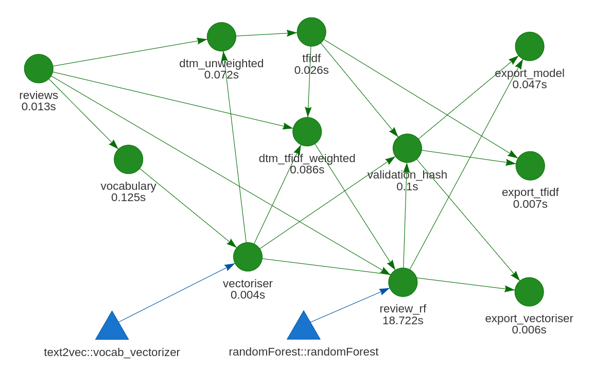
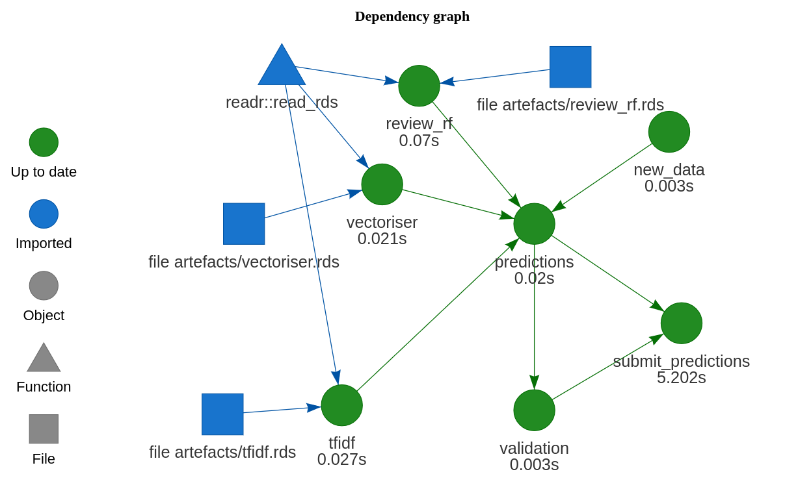
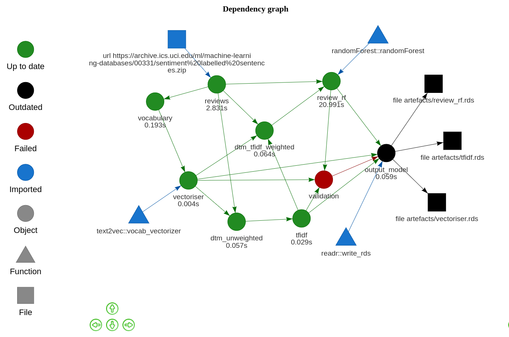

<!-- badges: start -->
[](https://github.com/mdneuzerling/DrakeModelling)
<!-- badges: end -->

# DrakeModelling

[drake](https://github.com/ropensci/drake) is an excellent tool for managing large and complicated workflows. It is the R equivalent of the `make` command, with a particular emphasis on using R functions.

## Concept

When it comes to code, there are three major components to a machine learning project:

1) Exploratory data analysis (EDA)
2) Model training
3) Model execution

These components are run independently of each other. EDA is a largely human task, and is usually only performed when the model is created or updated in some major way. The other two components need not operate together --- if model retraining is expensive, or new training data is infrequently available, we might retrain a model on some monthly basis while scoring new data on a daily basis.

I pieced together this template that implements these three components using R-specific tools:

1) EDA --- **R Markdown**
2) Model training --- **drake**
3) Model execution --- **drake**

All three of these components might use similar functions. Typically we would place all of these functions in a directory (almost always called `R/`) and `source` them as needed. Here I want to try to combine these components into a custom R package.

R packages are the standard for complicated R projects. With packages, we gain access to the comprehensive `R CMD CHECK`, as well as `testthat` unit tests and `roxygen2` documentation. I'm certainly not the first to combine drake with a package workflow, but I wanted to have a single repository that combines all elements of a machine learning project.

This template uses a simple random forest sentiment analysis model, based on [labelled data available from the UCI machine learning repository](https://archive.ics.uci.edu/ml/datasets/Sentiment+Labelled+Sentences). Drake takes care of the data caching for us. This means that we can, say, adjust the hyper-parameters of our model and rerun the training plan, and only the modelling step and onward will be rerun.

This template considers machine learning workflows intended to be executed in batch --- for models that run as APIs, consider using `plumber` instead.

## Training and execution

After cloning the repo, navigate to the directory in which the files are located. The easiest way to do this is to open the project in RStudio.

Model training and execution plans are generated by functions in the package. The package doesn't actually need to be installed --- we can use `devtools::load_all()` to simulate the installation. The model can be trained with:

```
devtools::load_all()
drake::make(model_training_plan())
```



Model execution is run similarly:

```
devtools::load_all()
drake::make(model_execution_plan())
```



Model artefacts --- the random forest model, the vectoriser, and the tfidf weightings --- are saved to and loaded from the `artefacts/` directory. This is an arbitrary choice. We could just as easily use a different directory or remote storage.

I've simulated a production step with a `new_data_to_be_scored` function that returns a few reviews to be scored. Predictions are "submitted" through the `submit_prediction()` function. This function does nothing except sleep for 5 seconds. In practice we would submit model output wherever it needs to go --- locally, a cloud service, etc. It's hard to "productionise" a model when it's just a toy.

The exploratory data analysis piece can be found in the `inst/eda/` directory. It is compiled with `knitr`.

## Model and prediction verification

Both training and execution plans include a _verification_ step. These are functions that --- using the `assertthat` package --- ensure certain basic facts about the model and its predictions are true. If any of these assertions is false, an error is returned.

```
validate_model <- function(random_forest, vectoriser, tfidf = NULL) {
  model_sentiment <- function(x) sentiment(x, random_forest, vectoriser, tfidf)
  oob <- random_forest$err.rate[random_forest$ntree, "OOB"] # out of bag error

  assertthat::assert_that(model_sentiment("love") == "good")
  assertthat::assert_that(model_sentiment("bad") == "bad")
  assertthat::assert_that(oob < 0.4)

  TRUE
}
```

The model artefacts and predictions cannot be exported without passing this verification step. Their relevant drake targets are conditioned on the validation function returning `TRUE`:

```
output_model = drake::target(
  {
    dir.create("artefacts", showWarnings = FALSE)
    readr::write_rds(vectoriser, file_out("artefacts/vectoriser.rds"))
    readr::write_rds(tfidf, file_out("artefacts/tfidf.rds"))
    readr::write_rds(review_rf, file_out("artefacts/review_rf.rds"))
  },
  trigger = drake::trigger(condition = validation, mode = "blacklist")
)
```

For example, suppose I changed the assertion above to demand that my model must have an out-of-bag error of less than 0.01% before it can be exported. My model isn't very good, however, so that step will error. The execution steps are dependent on that validation, and so they won't be run.



The assertions I've included here are very basic. However, I think these steps of the plans are important and extensible. We could assert that a model:

* produces sensible outputs, based on type or domain.
* has an accuracy above a given threshold, based on one or more metrics.
* does not produce outputs that are biased against a particular group.

We could also assert that predictions of new data:

* are sensible.
* do not contain sensitive data.
* are not biased against particular groups.
